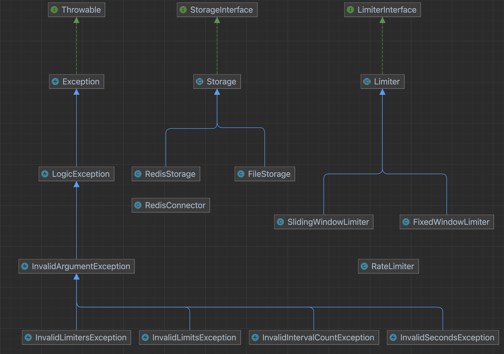

# PHP 限流器

使用 PHP 实现的限流器示例，不依赖其他扩展包，已内置固定窗口和滑动窗口限流，支持扩展其他限流策略，内置文件和 Redis 存储，支持扩展其他存储。

## 安装
```shell
composer require "baijunyao/rate-limiter"
```

## 使用
```php
<?php

use Baijunyao\RateLimiter\RateLimiter;
use Baijunyao\RateLimiter\Storage\FileStorage;
use Baijunyao\RateLimiter\Storage\RedisStorage;

$seconds = 60; // 秒数
$limits = 10; // 限制的次数
$key = 'user-1-login'; // 限制的对象的唯一标识 key，为 null 时用于限制全局
$windowCount = 2; // 分割的窗口数量，用于滑动窗口
$limiterType = 'sliding_window'; // 限流器类型，固定窗口为 fixed_window，滑动窗口为 sliding_window

// 使用文件存储
$storage = new FileStorage(__DIR__ . '/tmp');

// 使用 Redis 存储
$storage = new RedisStorage(__DIR__ . '/tmp');

// 创建 limiter 实例
$rateLimiter = new RateLimiter($storage, $seconds, $limits, $key, $windowCount);
$limiter = $rateLimiter->createLimiter($limiterType);

// 判断是否限流
if ($limiter->isLimited()) {
    // 限流;
} else {
    // 通过;
}
```

## 结构设计图



## 扩展

### 限流方案

通过继承 `Baijunyao\RateLimiter\Limiter\Limiter` 可以快速实现自定义的限流方案。
也可以通过实现 `Baijunyao\RateLimiter\Limiter\LimiterInterface` 接口来更灵活的实现自定义的限流方案。

### 存储方案

通过继承 `Baijunyao\RateLimiter\Storage\Storage` 可以快速实现自定义的存储方案。
也可以通过实现 `Baijunyao\RateLimiter\Storage\StorageInterface` 接口来更灵活的实现自定义的存储方案。

## 单元测试

```shell
composer test
```

## 代码风格检查

```shell
composer phpcs
```
